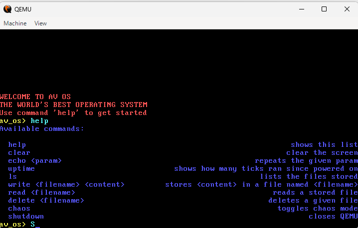

# AV's Rusty OS

Operating System made in Rust for x86-64 machines

## Description

AV OS is an experimental, bare-metal operating system kernel built in Rust. Designed as a no_std environment, it circumvents the standard library to establish low-level control over hardware.

The project has these features:

* **Custom Shell Application:** Boots up by default. Has a couple of commands for managing memory(writing files) and misc.

* **Asynchronous Architecture:** Implements a cooperative multitasking model using a custom Executor, enabling task management

* **Memory Management:** Uses a physical memory frame allocator and a virtual memory mapper to support a dynamic heap. Uses Linked List Allocator

* **Hardware Interface:** Manages the system via VGA buffer for text display and serial port communication. Now comes with different colors in chaos mode!

Overall, I learned a lot during this project... 25 hours of gibberish. Between Rust and C, I think Rust was easy to learn and use.

## Demo

In case you don't want to install and run it, here's a little demo of how it would look!

<table>
  <tr>
    <td width="50%" align="center">
      <h3>Shell</h3>
      
    </td>
    <td width="50%" align="center">
      <h3>Demo Video</h3>
        <video src="assets/AV_OS-Demo.mp4" controls width="100%"></video>
    </td>
  </tr>
</table>

### Dependencies

* In case it's not obvious, you'll need to run Rust code. Make sure you have `cargo`, and `rustup`!
* `Rust Nightly`, to run unsafe features. Install using `rustup default nightly`
* `rust-src`, install using `rustup component add rust-src`
* `bootimage`, install usign `cargo install bootimage`
* You will need some way to run the .bin file. I've been using `QEMU` as an emulator, but you could boot to a `Real x86-64 Machine`

### Installing

* Go to [releases](https://github.com/AV-01/AV-OS/releases) and download the latest `bootimage-av_os.bin` file.
* Or, if you've installed all the dependencies, then run the commands:
    * `cargo build --release`
    * `cargo bootimage --release`
    * Go to terminal and make sure you're in the same directory as `target\x86_64-av_os\release\`
    * There, you will find the `bootimage-av_os.bin` file!

### Executing program

#### If you are using QEMU as emulator
* Make sure you have [installed QEMU](https://www.qemu.org/)
* Open terminal and navigate to the same folder as your `bootimage-av_os.bin`
* Then, run the command: `qemu-system-x86_64 -drive file=bootimage-av_os.bin,format=raw`
* Enjoy the magic!

#### If you are running on a real machine

* I've never tested on a real machine...
* So... I'm not really sure... 
* I think you need a USB or something

> [!WARNING]
> I've never ran this code on a real machine. It might work great! It might explode :(
> I am not liable for whatever happens!!

## Help

Open an issue if you need help!

## Version History

* 1.1.0
    * Added delete command
    * Fixed bug with write command
* 1.0.0
    * Added ls, read, & write commands
    * Added filesystem management
* 0.2.0
    * Added echo & uptime commands
    * Fixed bug with shutdown command
* 0.1.0
    * Initial Release

## License

This project is licensed under the MIT License - see the LICENSE.md file for details

## Authors

Credit to [Philipp Oppermann's tutorial](https://os.phil-opp.com/)

Made with ❤️ by AV